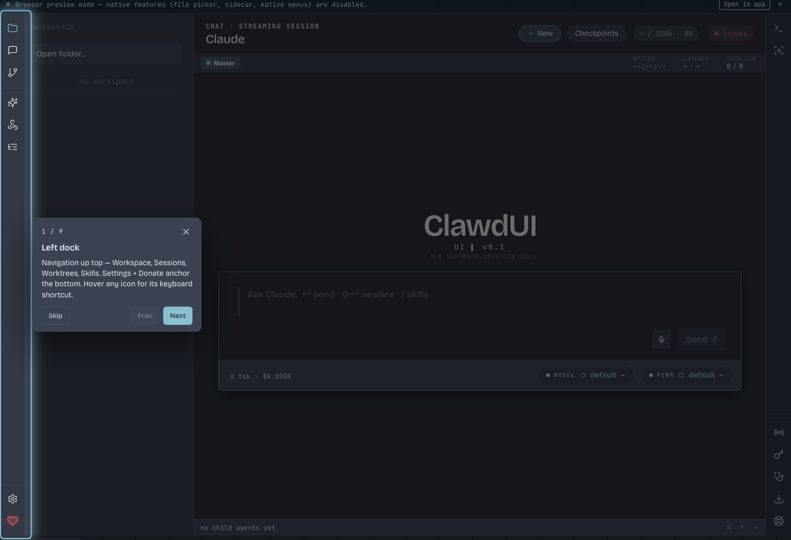
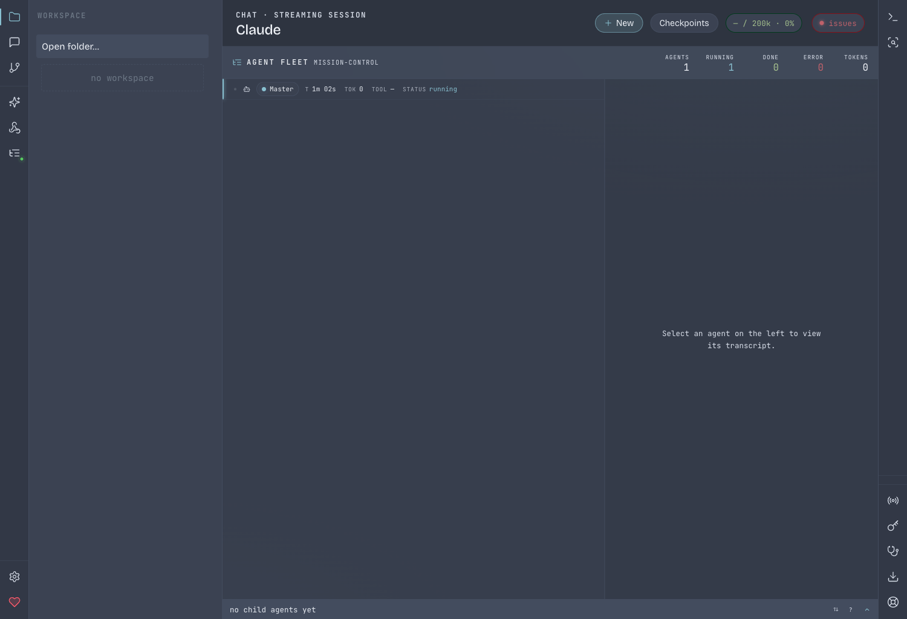
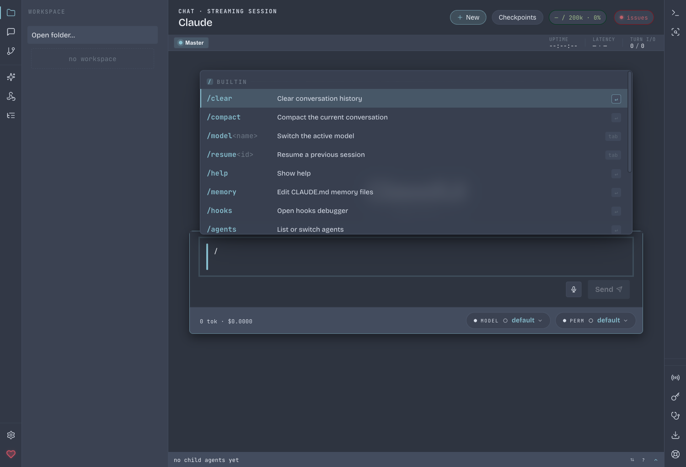
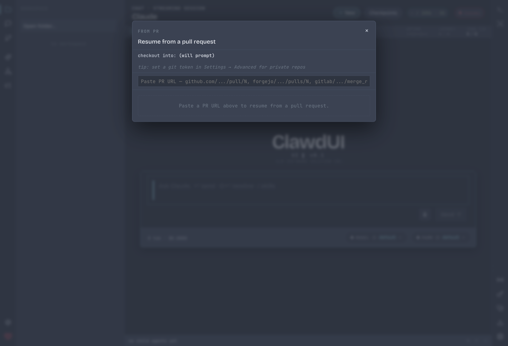
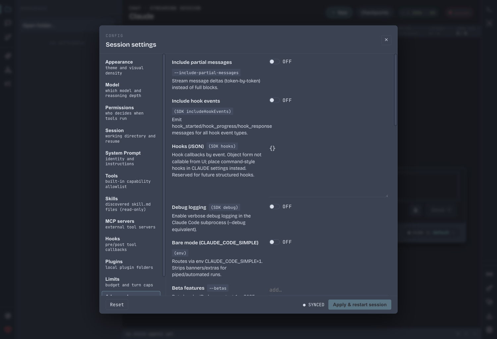
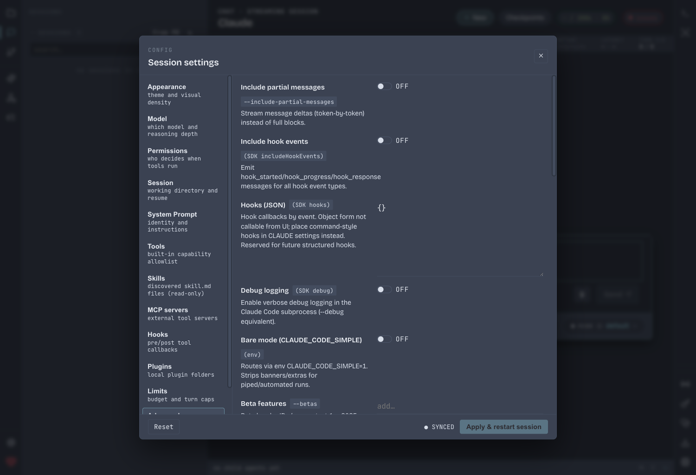
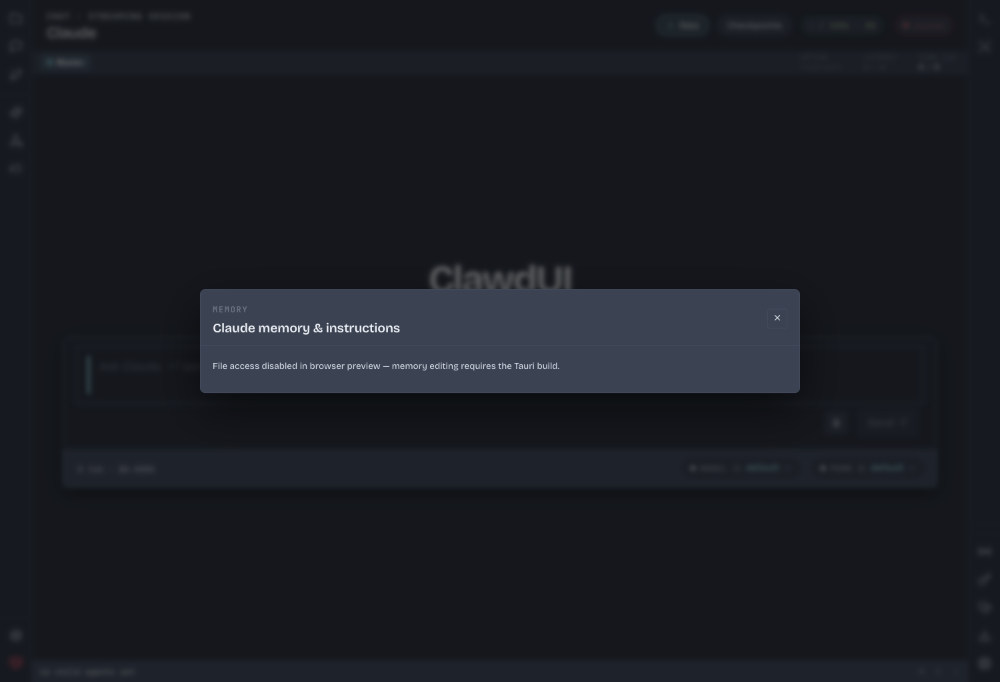
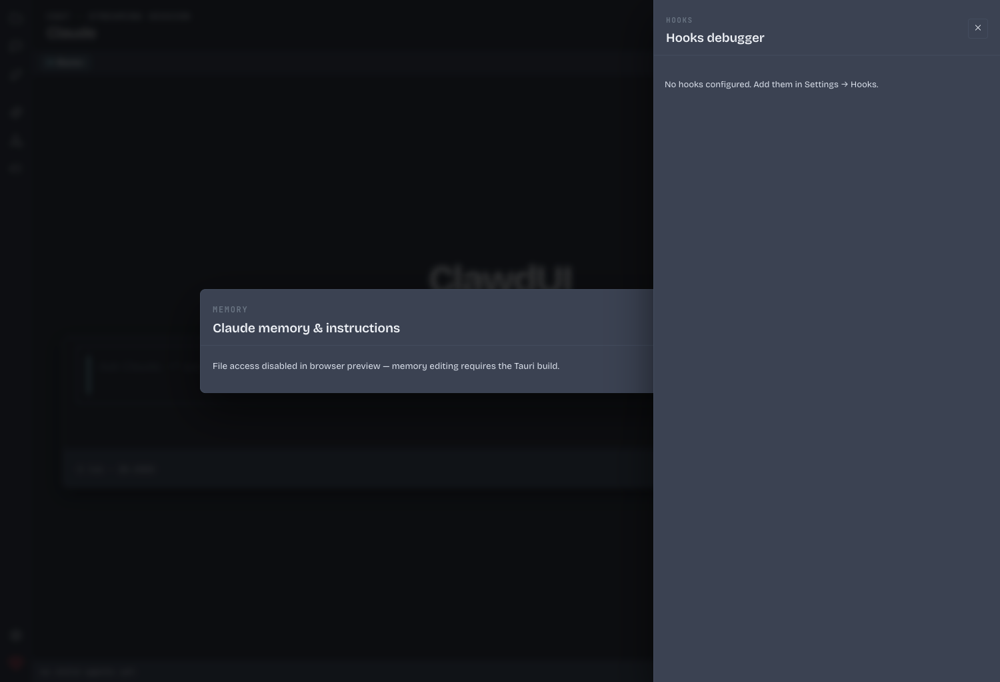

<!--
SPDX-License-Identifier: Apache-2.0
Copyright (c) SLR Software Solutions Inc.
-->

# ClawdUI — Native desktop GUI for Claude Code

[](https://www.apache.org/licenses/LICENSE-2.0)
[](https://buymeacoffee.com/slrsoft.ca)

> **Claude Code, with a face.** ClawdUI wraps the official [Claude Code](https://docs.claude.com/en/docs/claude-code) CLI in a tiny native window so you can drive multi-agent sessions, inspect hooks, replay checkpoints, and share a session with your phone — without giving up the terminal-grade fidelity of the CLI itself. Same `~/.claude/projects/` on disk, same agent SDK under the hood, same `claude` binary on your PATH.

## Screenshots

| | |
|---|---|
|  |  |
|  |  |
|  |  |
|  |  |

## Features

| | |
|---|---|
| **Multi-agent Fleet View** | Run several Claude Code sessions in parallel — each with its own cwd, model, and permission mode — and watch them tick in one pane. |
| **Slash menu (19 commands)** | `/agents`, `/checkpoints`, `/clear`, `/commit`, `/compact`, `/feedback`, `/fork`, `/help`, `/hooks`, `/init`, `/mcp`, `/memory`, `/model`, `/permissions`, `/plan`, `/pr`, `/resume`, `/undo`, `/worktree`. |
| **Hooks debugger** | Inspect every `UserPromptSubmit`, `PreToolUse`, `PostToolUse`, etc. firing in your session, with timing and exit codes. |
| **Headless mode** | `clawdui -p "fix the failing test"` for scripts and CI. Same agent context as the GUI — settings, MCP servers, hooks all apply. |
| **CLI ↔ UI session interop** | Sessions are stored under `~/.claude/projects/` exactly where the `claude` CLI puts them. Start in the terminal, resume in the GUI (or vice-versa). |
| **Voice input** | Hold-to-talk dictation via the OS speech APIs. Native, no cloud round-trip. |
| **Checkpoints** | One-keystroke snapshots of session state; rewind without losing the conversation. |
| **Plan mode** | First-class UI for the SDK's `plan` permission mode — review, edit, accept. |
| **MCP integration** | Edit `mcpServers` JSON live; toggle `strictMcpConfig`; pin allowed tools per server. |
| **Mobile pair (remote control)** | Drive a desktop session from your phone over a WebSocket relay you host. See [`docs/REMOTE_CONTROL_PROTOCOL.md`](docs/REMOTE_CONTROL_PROTOCOL.md). |

## Installation

### macOS (Apple Silicon, recommended)

1. Download the latest `.dmg` from [GitHub Releases](https://github.com/SLR-Software-Solutions-Inc/ClawdUI/releases).
2. Open the DMG, drag `ClawdUI.app` into `/Applications`.
3. Launch. The binary is signed with `Developer ID Application` (SLR Software Solutions Inc.) and notarized by Apple, so no Gatekeeper override is needed.

### Windows / Linux

Pre-built bundles (`.msi`, `.exe`, `.deb`, `.AppImage`, `.rpm`) are attached to each [release](https://github.com/SLR-Software-Solutions-Inc/ClawdUI/releases). macOS arm64 is the primary target; Windows and Linux builds are produced from the same source on every tagged release.

## Quick start

1. **Open a folder.** ClawdUI uses it as the session `cwd` — same as `claude` in that directory.
2. **Ask a question.** The sidecar boots a streaming session and the answer streams back token-by-token.
3. **Watch the agents work.** Tool calls (Read, Edit, Bash, ...) appear inline with their inputs and outputs. Approve, reject, or set a permission mode once for the whole session.

## Requirements

- **Claude Code CLI** installed and authenticated (`claude auth status` should print a logged-in user). ClawdUI delegates credentials to the CLI — it never reads your API key directly.
- **macOS 14** (Sonoma) or newer, **Windows 10** or newer, or a modern **Linux x64** distro with WebKit2GTK.
- ~150 MB disk for the app; sessions live under `~/.claude/projects/`.

## Headless usage

```sh
# One-shot, plain text output
clawdui -p "summarize the diff in this branch"

# Stream JSON events to a file (useful in CI)
CLAWDUI_OUTPUT_FORMAT=stream-json clawdui -p "review src/auth.ts" > events.ndjson

# Pick a model and constrain tools
clawdui -p "fix the failing test" \
  --model claude-sonnet-4-5 \
  --max-turns 12 \
  --allowed-tools Read,Edit,Bash
```

Headless mode resolves the local `claude` binary, applies your persisted settings (MCP servers, permission mode, system prompt, hooks), and streams the same event types the GUI consumes.

## License

[Apache 2.0](./LICENSE). See `NOTICE` for attribution.

## Disclaimer

ClawdUI is an **independent project**. It is **not affiliated with, endorsed by, or sponsored by Anthropic**. "Claude" and "Claude Code" are trademarks of Anthropic, PBC. ClawdUI uses the official `@anthropic-ai/claude-agent-sdk` and the publicly-distributed `claude` CLI; no proprietary API access is required or implied.

## Author

Built and maintained by **SLR Software Solutions Inc.** Issues, PRs, and donations welcome.

[](https://buymeacoffee.com/slrsoft.ca)
